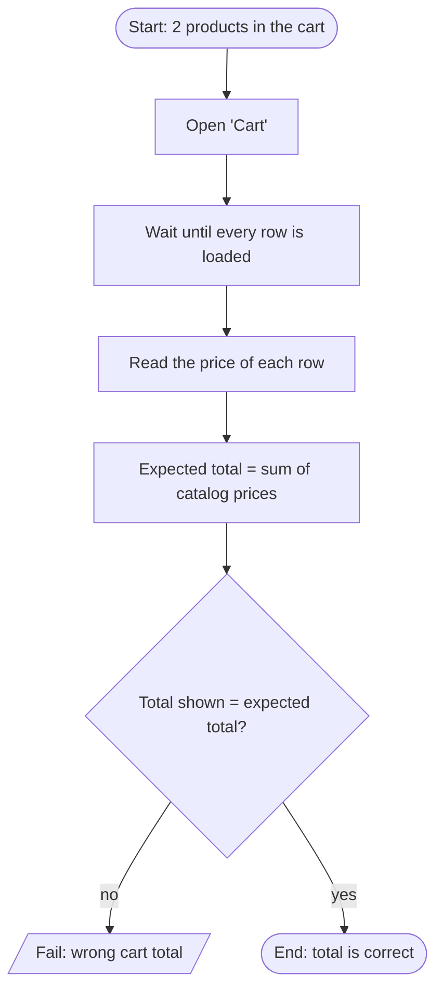

# TC-02 — Cart total equals the sum of the product prices

Requirements: PUR-02 · Plan: [plan](../plans/demoblaze-purchase.md) · Oracle: `examples/demoblaze/data/catalog.json`

```mermaid
flowchart TD
  A([Start: 2 products in the cart]) --> B[Open 'Cart']
  B --> C[Wait until every row is loaded]
  C --> D[Read the price of each row]
  D --> E[Expected total = sum of catalog prices]
  E --> F{Total shown = expected total?}
  F -- no --> X[/Fail: wrong cart total/]
  F -- yes --> Z([End: total is correct])
```
