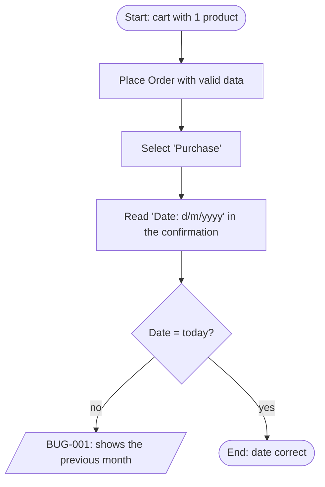

# TC-05 — Confirmation date is today

Requirements: PUR-04 · Plan: [qa/plans/demoblaze-purchase.md](../../plans/demoblaze-purchase.md) · Known defect: BUG-001

```mermaid
flowchart TD
  A([Start: cart with 1 product]) --> B[Place Order with valid data]
  B --> C[Select 'Purchase']
  C --> D[Read 'Date: d/m/yyyy' in the confirmation]
  D --> E{Date = today?}
  E -- no --> X[/BUG-001: shows the previous month/]
  E -- yes --> Z([End: date correct])
```
