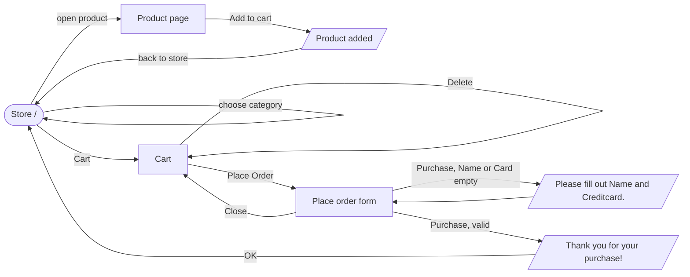

# Demoblaze — purchase journey (reconnaissance)

> Example. Removed by `remove-example.bat`.

```mermaid
flowchart LR
  Store([Store /]) -- choose category --> Store
  Store -- open product --> Product[Product page]
  Product -- Add to cart --> Alert[/"Product added"/]
  Alert -- back to store --> Store
  Store -- Cart --> Cart[Cart]
  Cart -- Delete --> Cart
  Cart -- Place Order --> Form[Place order form]
  Form -- Close --> Cart
  Form -- Purchase, Name or Card empty --> Error[/"Please fill out Name and Creditcard."/]
  Error --> Form
  Form -- Purchase, valid --> Thanks[/"Thank you for your purchase!"/]
  Thanks -- OK --> Store
```
